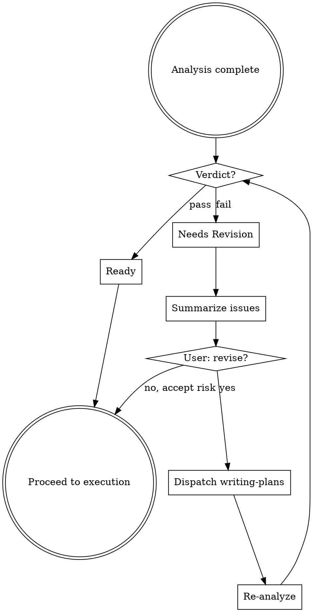

# Analyzing Plans

Architectural review gate between plan creation and execution. Catches design issues BEFORE code is written. Runs as subagent for objectivity.

**Announce:** "Using analyzing-plans to review architecture before execution."

## When This Runs

- Automatically after writing-plans completes (mandatory gate)
- Explicitly when reviewing external/old plans
- Before resuming paused implementation

## Dispatch as Subagent

Launch Plan agent with this prompt template:

```
Review this implementation plan for architectural soundness and maintainability.

PLAN LOCATION: {plan_file_path}

CODEBASE: Explore existing patterns in the repository to check consistency.

Use the Analysis Checklist below. Output the Analysis Report format.

## Analysis Checklist

### Architecture (SOLID)
- Single Responsibility: Each component one purpose?
- Open/Closed: Extensible without modification?
- Liskov Substitution: Subtypes substitutable?
- Interface Segregation: No forced dependencies?
- Dependency Inversion: Depend on abstractions?

### Maintainability
- Naming clear and consistent with codebase?
- Complexity minimized? Simpler alternatives exist?
- Testing strategy sound? Tests meaningful (not mocks)?
- Error handling comprehensive?
- Edge cases covered?

### Codebase Consistency
- Follows existing patterns in repo?
- Naming matches conventions?
- File structure aligns with existing?
- Uses established abstractions?

### Scope
- YAGNI: Everything actually needed?
- DRY: No unnecessary duplication?
- Over-engineering avoided?
- Under-engineering avoided?

### Risk
- Breaking changes identified?
- Security considered (input validation, auth, data exposure)?
- Performance bottlenecks obvious?
- External dependencies assessed?

## Analysis Report Format

### [Plan Name] Analysis Report

**Verdict:** Ready / Needs Revision / Major Rework

#### Critical (Must Fix Before Execution)
- [Issue]: [task number or file reference from plan]
  - Why: [impact]
  - Fix: [recommendation]

#### Important (Should Fix)
- [Issue]: [reference]
  - Why: [impact]
  - Fix: [recommendation]

#### Minor (Note for Implementation)
- [observation]

#### Codebase Consistency Table

| Pattern | Codebase Convention | Plan Deviation |
|---------|---------------------|----------------|
| [area] | [existing pattern] | [what plan does differently] |

#### Missing Tests Flag
- Does plan include test steps? If no: CRITICAL issue.
- Do tests use real implementations (not mocks per CLAUDE.md)?

#### Critical Files for Implementation
- [file path] - [why relevant to this plan]

#### Verdict Reasoning
[2-3 sentences explaining the verdict]
```

## On Critical Issues



If verdict = "Needs Revision" or "Major Rework":

1. Present issues summary to user
2. Ask: "Revise plan to address these issues?"
3. If yes: dispatch writing-plans with issues as context
4. Re-run analyzing-plans on revision
5. Loop until "Ready" or user accepts risk

## Red Flags (Skip Rationalizations)

| Excuse | Reality |
|--------|---------|
| "Plan is simple" | Simple plans have bugs too. Review takes 2 min. |
| "I wrote it" | Author bias is real. Fresh eyes catch issues. |
| "Time pressure" | Rework costs 10x review time. |
| "Already brainstormed" | Design phase != implementation plan review. |
| "Just want to start coding" | Coding wrong thing wastes more time. |
| "Agent already reviewed it" | Without skill, review may miss codebase patterns. |
| "User seems impatient" | User wants working code, not fast broken code. |

## Integration with Workflow

**After writing-plans completes:**

Do NOT offer execution options until analysis passes.

```
writing-plans saves plan
  → "Plan saved. Running architectural analysis..."
  → dispatch analyzing-plans subagent
  → if Ready: offer execution options
  → if issues: present report, ask about revision
```

**Standalone invocation:**

```
User: "Review this plan: docs/plans/feature-x.md"
  → dispatch analyzing-plans subagent
  → present report
```
