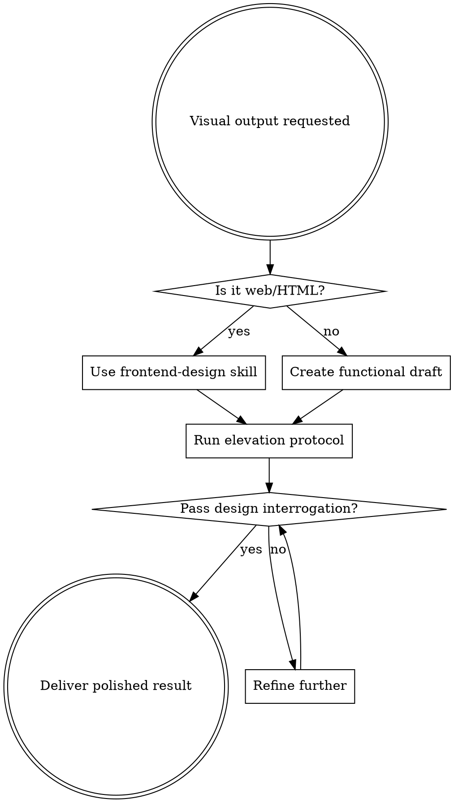

# Design Elevation

Apply professional design thinking to visual outputs. Start functional, then systematically elevate to production-quality through interrogation and refinement.

## Triggers

Activate for: presentations, slide decks, dashboards, reports, HTML artifacts, PDFs, spreadsheets, data visualizations, charts, diagrams, infographics, email templates, landing pages.

## Workflow

## Process (Internal)

1. **Draft**: Build content-complete functional version
2. **Elevate**: Apply elevation-protocol.md systematically
3. **Interrogate**: Run design-interrogation.md checklist
4. **Refine**: Address any gaps, repeat until satisfied
5. **Deliver**: Present polished result only

**Silent mode**: User sees final output unless they ask "show me your design thinking" or "explain your design choices."

## Reference Files

Consult during elevation:
- **design-interrogation.md** - Questions before delivery
- **technique-catalog.md** - Specific visual techniques
- **design-references.md** - Exemplars and movements
- **elevation-protocol.md** - Refinement process
- **design-philosophy.md** - Guiding principles

## Integration

For HTML/web interfaces: Use frontend-design skill for aesthetic guidance, then return here for final elevation protocol.

## Quick Check

Before delivering, confirm:
- [ ] Would a design director approve this?
- [ ] Does it look hand-crafted, not template-based?
- [ ] Are typography, color, and layout all intentional?
- [ ] Is there one memorable element?
